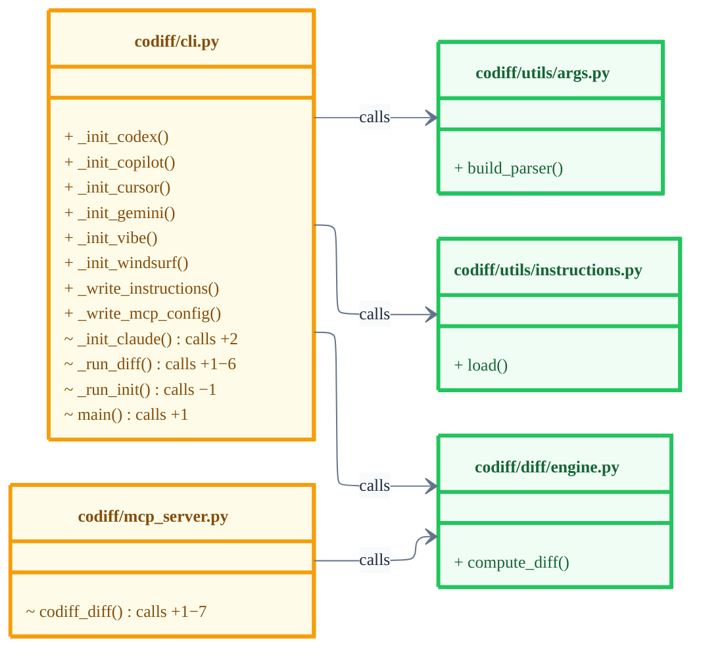

# codiff

A structural call-graph diff tool for multi-language codebases, built to work with coding agents. Instead of a line diff, it shows what changed at the function level, which functions were added and where they hook into existing code, which were modified, which were removed, with call relationships mapped across files.

Here's the output of `codiff diff --base main --format mermaid` run on codiff's own codebase:



Each box is a file or class. **Green** = only additions, **yellow** = at least one modification. Inside each box: `+` added function, `~` modified. Annotations: `sig` = signature changed, `calls +N−N` = now calls N more / N fewer functions. Arrows show which files call into which.

## Supported languages

| Language | Extensions |
|---|---|
| Python | `.py` |
| TypeScript | `.ts`, `.tsx` |

## How it works

codiff maintains a SQLite call-graph index (`.codiff.db`) at the repo root. On first run it does a full parse; on subsequent runs it re-parses only the files changed since the last indexed commit, then detects stale callers (functions whose callees were renamed or deleted) and re-parses those too. Both the base and head snapshots are built incrementally from this index, so diffs stay fast even on large codebases.

The graph delta — added, modified, removed functions — is computed deterministically from the resolved call graph. No LLM, no embeddings, fully offline.

## Requirements

- Python 3.11+
- Git

## Installation

```bash
pip install git+https://github.com/issahammoud/codiff.git
```

## Usage

### CLI

```bash
# Index a repository (writes .codiff.db — runs automatically on first diff)
codiff index <path>

# Diff
codiff diff                          # diff HEAD vs working tree (terminal output)
codiff diff --format mermaid         # output a Mermaid class diagram
codiff diff --format json            # output structured JSON (for editor integrations)
codiff diff --base main              # diff a specific base ref
codiff diff --head <ref>             # diff two git refs directly
codiff diff --repo /path/to/repo     # diff a different repo
codiff diff --include-tests          # include test functions (hidden by default)
codiff diff --include-deleted        # include deleted functions (hidden by default)
codiff diff --workers 8              # set parallel worker count (default: cpu_count // 2)
codiff diff --debug                  # print timing breakdown for each processing step

# Configure a coding agent (see Agent integration below)
codiff init --agent <agent>
```

### Output formats

| Format | Description |
|---|---|
| `terminal` | Colored terminal output with UML-style boxes (default) |
| `mermaid` | Two Mermaid `classDiagram` blocks — paste into any Markdown file or PR description |
| `json` | Structured JSON — consumed by editor integrations (e.g. the VS Code extension) |

### Agent integration (MCP + project instructions)

Run once per project to configure your coding agent:

```bash
codiff init --agent claude      # Claude Code
codiff init --agent cursor      # Cursor
codiff init --agent copilot     # GitHub Copilot (VS Code 1.99+)
codiff init --agent codex       # OpenAI Codex CLI
codiff init --agent windsurf    # Windsurf
codiff init --agent gemini      # Gemini CLI
codiff init --agent vibe        # Mistral Vibe
```

Each command writes the MCP server config and a project instructions file telling the agent to use the `codiff_diff` MCP tool when creating pull requests:

| Agent | MCP config | Instructions file |
|---|---|---|
| `claude` | `.mcp.json` | `CLAUDE.md` |
| `cursor` | `.cursor/mcp.json` | `.cursor/rules/codiff.mdc` |
| `copilot` | `.vscode/mcp.json` | `.github/copilot-instructions.md` |
| `codex` | `.codex/config.toml` | `AGENTS.md` |
| `windsurf` | `~/.codeium/windsurf/mcp_config.json` ¹ | `.windsurfrules` |
| `gemini` | — ² | `GEMINI.md` |
| `vibe` | `.vibe/config.toml` ³ | — |

¹ Windsurf MCP config is global (not project-scoped). Restart Windsurf after running.
² Gemini CLI MCP config is global (`~/.gemini/settings.json`) — add `codiff-mcp` there manually.
³ Mistral Vibe uses a TOML config; no separate instructions file.

When creating a pull request, the agent calls `codiff_diff(base_ref="main", head_ref="HEAD", format="mermaid")` and embeds the returned diagram in the PR description. GitHub renders Mermaid natively — no plugin needed.

## Reading the terminal output

The output shows one box per changed file. Boxes are laid out side by side when they fit the terminal width, with labeled arrows between adjacent connected boxes.

### Inside each file box

Methods belonging to the same class are grouped into a **dashed sub-box** (╭╌╌╌ `ClassName` ╌╌╌╮). Standalone functions appear directly in the file box. Deleted functions (only shown with `--include-deleted`) are collected into a red **╭╌╌╌ deleted ╌╌╌╮** sub-box.

Functions are listed with an indicator and an annotation:

| Indicator | Meaning |
|---|---|
| `+` green | Function was added |
| `~` yellow | Function was modified |
| `-` red | Function was removed |

| Annotation | Meaning |
|---|---|
| `entry point` | Nothing calls this new function — new public surface |
| `sig changed` | Parameters or return type changed |
| `calls changed` | The function now calls different things |
| `body changed` | Pure implementation change |

For added functions, `→` arrows show intra-file call relationships — a function indented under another calls it.

### Intra-file class relationships

When two changed classes in the same file are related, each class box shows a dim annotation before its methods:

```
╭╌╌╌ PageAwarePreChunker ╌╌╌╮
│ calls  PageAwarePreChunkBuilder  │
│ ──────────────                   │
│ + __init__                       │
╰╌╌╌╌╌╌╌╌╌╌╌╌╌╌╌╌╌╌╌╌╌╌╌╌╌╌╌╌╌╌╌╯
```

Relationship types: `calls` (method calls to another class) and `inherits` (superclass relationship detected from class definitions).

### Colors

Functions that form a connected call chain share a color across the entire output — across boxes, across files. All magenta names belong to one chain, all cyan to another.

- **Chain color** on the function name — part of a call chain
- **White** on the function name — added/modified but not connected to any chain
- **`~` yellow** — always marks a modified function regardless of chain membership

### Arrows between file boxes

Labeled arrows appear between adjacent file boxes when there is a cross-file relationship:

| Label | Meaning |
|---|---|
| `calls ────▶` | A function in the left file calls a function in the right file |
| `inherits ────▶` | A class in the left file inherits from a class in the right file |

## Reading the Mermaid output

The Mermaid format produces **two diagrams**:

1. **Connected modules** — files that have call or inheritance relationships with other changed files. Rendered with ELK layout left-to-right, with `calls` and `inherits` arrows between class boxes.

2. **Isolated modules** — files with no cross-file relationships (e.g. migration files, config). Grouped by their top two folder levels into namespace clusters, rendered with Dagre left-to-right.

Both diagrams use color-coded class boxes:
- **Green** — only additions in this file/class
- **Yellow** — at least one modification
- **Red** — only deletions (requires `--include-deleted`)

Inside each box, functions are listed with a prefix and optional annotation:

| Prefix | Meaning |
|---|---|
| `+` | Function was added |
| `~` | Function was modified |
| `-` | Function was removed |

| Annotation | Meaning |
|---|---|
| `sig` | Parameters or return type changed |
| `calls +N−N` | Call list changed — N new callees, N dropped |

When a class appears inside a file box, its file path is shown as a `«stereotype»` subtitle below the class name.
