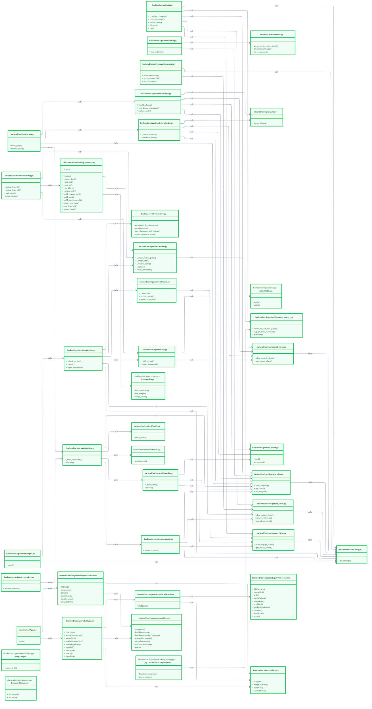
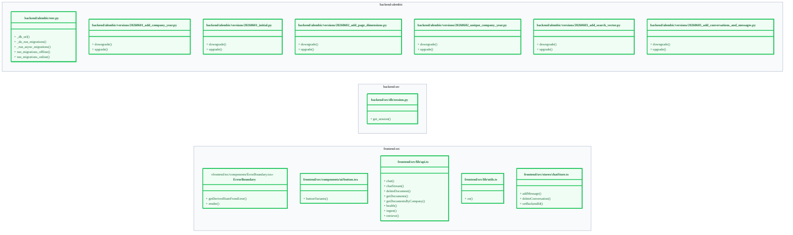

```mermaid
%%{init: {'layout': 'elk', 'elk': {'direction': 'RIGHT'}, 'maxTextSize': 999999, 'theme': 'base', 'themeVariables': {'background': '#ffffff', 'clusterBkg': '#f8fafc', 'clusterBorder': '#94a3b8', 'primaryColor': '#f8fafc', 'primaryBorderColor': '#94a3b8', 'primaryTextColor': '#1e293b', 'lineColor': '#64748b', 'fontSize': '13px', 'fontFamily': 'ui-monospace, SFMono-Regular, Menlo, monospace'}}}%%
classDiagram
    direction LR

    class n13["backend/src/agent/graph.py"] {
        + build_graph()
        + retrieve_node()
    }

    class n17["backend/src/api/main.py"] {
        + _configure_logging()
        + _run_migrations()
        + health_check()
        + lifespan()
        + root()
    }

    class n18["backend/src/api/routers/chat.py"] {
        + chat_endpoint()
    }

    class n19["backend/src/api/routers/debug.py"] {
        + _debug_from_db()
        + _debug_from_pdf()
        + _safe_stem()
        + debug_chunks()
    }

    class n20["backend/src/api/routers/documents.py"] {
        + delete_document()
        + get_document_file()
        + list_documents()
    }

    class n21["backend/src/api/routers/ingest.py"] {
        + ingest()
    }

    class n22["backend/src/api/routers/retrieve.py"] {
        + retrieve_endpoint()
    }

    class n43["frontend/src/App.tsx"] {
        + App()
    }

    class n0["QueryAnalysis"] {
        <<backend/src/agent/nodes/analyze.py>>
        + clamp_top_k()
    }
    class n14["backend/src/agent/nodes/analyze.py"] {
        + _build_schema()
        + _get_known_companies()
        + analyze_node()
    }

    class n15["backend/src/agent/nodes/synthesize.py"] {
        + _format_context()
        + synthesize_node()
    }

    class n28["backend/src/db/memory.py"] {
        + get_or_create_conversation()
        + get_recent_messages()
        + save_messages()
    }

    class n42["backend/src/utils/debug_renderer.py"] {
        + _badge()
        + _images_html()
        + _img_ext()
        + _img_uri()
        + _pre_block()
        + _render_body()
        + build_cropped_uris()
        + build_html()
        + build_html_from_db()
        + chunk_from_orm()
        + crop_from_pdf()
        + render_chunk()
        ... 2 more
    }

    class n35["backend/src/ingestion/pipeline.py"] {
        + _chunk_to_dict()
        + _result()
        + ingest_document()
    }

    class n39["backend/src/retrieval/pipeline.py"] {
        + _fetch_candidates()
        + retrieve()
    }

    class n45["frontend/src/components/layout/Sidebar.tsx"] {
        + Sidebar()
        + companies()
        + groups()
        + handleNew()
        + handleSwitch()
        + groupByDate()
    }

    class n51["frontend/src/pages/ChatPage.tsx"] {
        + ChatPage()
        + activeConversation()
        + bottomRef()
        + handleCitationClick()
        + handleKeyDown()
        + inputRef()
        + messages()
        + submit()
        + InputBox()
    }

    class n16["backend/src/agent/state.py"] {
        + format_history()
    }

    class n29["backend/src/db/repository.py"] {
        + get_chunks_for_document()
        + get_document()
        + save_document_with_chunks()
        + update_document_status()
    }

    class n31["backend/src/ingestion/chunker.py"] {
        + _attach_section_paths()
        + _image_entry()
        + _resolve_tables()
        + _replace()
        + chunk_document()
    }

    class n33["backend/src/ingestion/embedder.py"] {
        + _point_id()
        + embed_chunks()
        + upsert_to_qdrant()
    }

    class n2["ExtractedDocument"] {
        <<backend/src/ingestion/ocr.py>>
        + all_images()
        + full_text()
    }
    class n34["backend/src/ingestion/ocr.py"] {
        + _call_ocr_api()
        + extract_document()
    }
    class n4["ExtractedPage"] {
        <<backend/src/ingestion/ocr.py>>
        + full_markdown()
        + has_images()
        + image_count()
    }
    class n3["ExtractedImage"] {
        <<backend/src/ingestion/ocr.py>>
        + height()
        + width()
    }

    class n37["backend/src/retrieval/bm25.py"] {
        + bm25_search()
    }

    class n38["backend/src/retrieval/fusion.py"] {
        + weighted_rrf()
    }

    class n40["backend/src/retrieval/reranker.py"] {
        + _build_query()
        + rerank()
    }

    class n41["backend/src/retrieval/semantic.py"] {
        + semantic_search()
    }

    class n46["frontend/src/components/pdf/PDFPanel.tsx"] {
        + PDFPanel()
    }

    class n53["frontend/src/stores/documentStore.ts"] {
        + companies()
        + fetchDocuments()
        + fetchDocumentsByCompany()
        + selectedDocuments()
        + toggleDocument()
        + useDocumentStore()
        + years()
    }

    class n1["_ByTitleWithMaxPagesOptions"] {
        <<backend/src/ingestion/chunking_strategy.py>>
        + boundary_predicates()
        + iter_predicates()
    }
    class n32["backend/src/ingestion/chunking_strategy.py"] {
        + chunk_by_title_max_pages()
        + is_page_span_exceeded()
        + predicate()
    }

    class n25["backend/src/core/mistral_client.py"] {
        + close_mistral_client()
        + get_mistral_client()
    }

    class n36["backend/src/prompt_loader.py"] {
        + _load()
        + get_prompt()
    }

    class n24["backend/src/core/langfuse_client.py"] {
        + flush_langfuse()
        + get_tracer()
        + init_langfuse()
    }

    class n26["backend/src/core/qdrant_client.py"] {
        + close_qdrant_client()
        + ensure_collection()
        + get_qdrant_client()
    }

    class n27["backend/src/core/voyage_client.py"] {
        + close_voyage_client()
        + get_voyage_client()
    }

    class n47["frontend/src/components/pdf/PDFViewer.tsx"] {
        + PDFViewer()
        + canvasRef()
        + goTo()
        + handleWheel()
        + renderPage()
        + scrollRef()
        + getHighlightRects()
        + citNorm()
        + itemNorm()
        + norm()
    }

    class n54["frontend/src/stores/pdfStore.ts"] {
        + closePDF()
        + mergeCitations()
        + openPDF()
        + usePDFStore()
    }

    class n23["backend/src/core/config.py"] {
        + get_settings()
    }

    style n13 fill:#f0fdf4,color:#166534,stroke:#22c55e,stroke-width:3px
    style n17 fill:#f0fdf4,color:#166534,stroke:#22c55e,stroke-width:3px
    style n18 fill:#f0fdf4,color:#166534,stroke:#22c55e,stroke-width:3px
    style n19 fill:#f0fdf4,color:#166534,stroke:#22c55e,stroke-width:3px
    style n20 fill:#f0fdf4,color:#166534,stroke:#22c55e,stroke-width:3px
    style n21 fill:#f0fdf4,color:#166534,stroke:#22c55e,stroke-width:3px
    style n22 fill:#f0fdf4,color:#166534,stroke:#22c55e,stroke-width:3px
    style n43 fill:#f0fdf4,color:#166534,stroke:#22c55e,stroke-width:3px
    style n0 fill:#f0fdf4,color:#166534,stroke:#22c55e,stroke-width:3px
    style n14 fill:#f0fdf4,color:#166534,stroke:#22c55e,stroke-width:3px
    style n15 fill:#f0fdf4,color:#166534,stroke:#22c55e,stroke-width:3px
    style n28 fill:#f0fdf4,color:#166534,stroke:#22c55e,stroke-width:3px
    style n42 fill:#f0fdf4,color:#166534,stroke:#22c55e,stroke-width:3px
    style n35 fill:#f0fdf4,color:#166534,stroke:#22c55e,stroke-width:3px
    style n39 fill:#f0fdf4,color:#166534,stroke:#22c55e,stroke-width:3px
    style n45 fill:#f0fdf4,color:#166534,stroke:#22c55e,stroke-width:3px
    style n51 fill:#f0fdf4,color:#166534,stroke:#22c55e,stroke-width:3px
    style n16 fill:#f0fdf4,color:#166534,stroke:#22c55e,stroke-width:3px
    style n29 fill:#f0fdf4,color:#166534,stroke:#22c55e,stroke-width:3px
    style n31 fill:#f0fdf4,color:#166534,stroke:#22c55e,stroke-width:3px
    style n33 fill:#f0fdf4,color:#166534,stroke:#22c55e,stroke-width:3px
    style n2 fill:#f0fdf4,color:#166534,stroke:#22c55e,stroke-width:3px
    style n34 fill:#f0fdf4,color:#166534,stroke:#22c55e,stroke-width:3px
    style n4 fill:#f0fdf4,color:#166534,stroke:#22c55e,stroke-width:3px
    style n3 fill:#f0fdf4,color:#166534,stroke:#22c55e,stroke-width:3px
    style n37 fill:#f0fdf4,color:#166534,stroke:#22c55e,stroke-width:3px
    style n38 fill:#f0fdf4,color:#166534,stroke:#22c55e,stroke-width:3px
    style n40 fill:#f0fdf4,color:#166534,stroke:#22c55e,stroke-width:3px
    style n41 fill:#f0fdf4,color:#166534,stroke:#22c55e,stroke-width:3px
    style n46 fill:#f0fdf4,color:#166534,stroke:#22c55e,stroke-width:3px
    style n53 fill:#f0fdf4,color:#166534,stroke:#22c55e,stroke-width:3px
    style n1 fill:#f0fdf4,color:#166534,stroke:#22c55e,stroke-width:3px
    style n32 fill:#f0fdf4,color:#166534,stroke:#22c55e,stroke-width:3px
    style n25 fill:#f0fdf4,color:#166534,stroke:#22c55e,stroke-width:3px
    style n36 fill:#f0fdf4,color:#166534,stroke:#22c55e,stroke-width:3px
    style n24 fill:#f0fdf4,color:#166534,stroke:#22c55e,stroke-width:3px
    style n26 fill:#f0fdf4,color:#166534,stroke:#22c55e,stroke-width:3px
    style n27 fill:#f0fdf4,color:#166534,stroke:#22c55e,stroke-width:3px
    style n47 fill:#f0fdf4,color:#166534,stroke:#22c55e,stroke-width:3px
    style n54 fill:#f0fdf4,color:#166534,stroke:#22c55e,stroke-width:3px
    style n23 fill:#f0fdf4,color:#166534,stroke:#22c55e,stroke-width:3px

    %% Relationships
    n1 --> n32 : calls
    n13 --> n14 : calls
    n13 --> n15 : calls
    n13 --> n24 : calls
    n13 --> n39 : calls
    n14 --> n16 : calls
    n14 --> n24 : calls
    n14 --> n25 : calls
    n14 --> n36 : calls
    n15 --> n16 : calls
    n15 --> n24 : calls
    n15 --> n25 : calls
    n15 --> n36 : calls
    n17 --> n23 : calls
    n17 --> n24 : calls
    n17 --> n25 : calls
    n17 --> n26 : calls
    n17 --> n27 : calls
    n18 --> n24 : calls
    n18 --> n28 : calls
    n19 --> n31 : calls
    n19 --> n34 : calls
    n19 --> n42 : calls
    n20 --> n23 : calls
    n20 --> n26 : calls
    n21 --> n23 : calls
    n21 --> n35 : calls
    n22 --> n39 : calls
    n24 --> n23 : calls
    n25 --> n23 : calls
    n26 --> n23 : calls
    n27 --> n23 : calls
    n31 --> n32 : calls
    n33 --> n27 : calls
    n34 --> n25 : calls
    n34 --> n3 : calls
    n35 --> n23 : calls
    n35 --> n26 : calls
    n35 --> n29 : calls
    n35 --> n31 : calls
    n35 --> n33 : calls
    n35 --> n34 : calls
    n39 --> n24 : calls
    n39 --> n37 : calls
    n39 --> n38 : calls
    n39 --> n40 : calls
    n39 --> n41 : calls
    n40 --> n24 : calls
    n40 --> n27 : calls
    n40 --> n36 : calls
    n41 --> n23 : calls
    n41 --> n24 : calls
    n41 --> n26 : calls
    n41 --> n27 : calls
    n42 --> n31 : calls
    n42 --> n4 : calls
    n43 --> n45 : calls
    n43 --> n51 : calls
    n45 --> n53 : calls
    n45 --> n54 : calls
    n46 --> n47 : calls
    n46 --> n54 : calls
    n51 --> n46 : calls
    n51 --> n53 : calls
    n51 --> n54 : calls
```

```mermaid
%%{init: {'maxTextSize': 999999, 'theme': 'base', 'themeVariables': {'background': '#ffffff', 'clusterBkg': '#f8fafc', 'clusterBorder': '#94a3b8', 'primaryColor': '#f8fafc', 'primaryBorderColor': '#94a3b8', 'primaryTextColor': '#1e293b', 'lineColor': '#64748b', 'fontSize': '13px', 'fontFamily': 'ui-monospace, SFMono-Regular, Menlo, monospace'}}}%%
classDiagram
    direction LR

    namespace backend-alembic {
        class n6["backend/alembic/env.py"] {
            + _db_url()
            + _do_run_migrations()
            + _run_async_migrations()
            + run_migrations_offline()
            + run_migrations_online()
        }
        class n7["backend/alembic/versions/20260601_add_company_year.py"] {
            + downgrade()
            + upgrade()
        }
        class n8["backend/alembic/versions/20260601_initial.py"] {
            + downgrade()
            + upgrade()
        }
        class n9["backend/alembic/versions/20260602_add_page_dimensions.py"] {
            + downgrade()
            + upgrade()
        }
        class n10["backend/alembic/versions/20260602_unique_company_year.py"] {
            + downgrade()
            + upgrade()
        }
        class n11["backend/alembic/versions/20260603_add_search_vector.py"] {
            + downgrade()
            + upgrade()
        }
        class n12["backend/alembic/versions/20260605_add_conversations_and_messages.py"] {
            + downgrade()
            + upgrade()
        }
    }

    namespace backend-src {
        class n30["backend/src/db/session.py"] {
            + get_session()
        }
    }

    namespace frontend-src {
        class n5["ErrorBoundary"] {
            <<frontend/src/components/ErrorBoundary.tsx>>
            + getDerivedStateFromError()
            + render()
        }
        class n48["frontend/src/components/ui/button.tsx"] {
            + buttonVariants()
        }
        class n49["frontend/src/lib/api.ts"] {
            + chat()
            + chatStream()
            + deleteDocument()
            + getDocuments()
            + getDocumentsByCompany()
            + health()
            + ingest()
            + retrieve()
        }
        class n50["frontend/src/lib/utils.ts"] {
            + cn()
        }
        class n52["frontend/src/stores/chatStore.ts"] {
            + addMessage()
            + deleteConversation()
            + setBackendId()
        }
    }

    style n6 fill:#f0fdf4,color:#166534,stroke:#22c55e,stroke-width:3px
    style n7 fill:#f0fdf4,color:#166534,stroke:#22c55e,stroke-width:3px
    style n8 fill:#f0fdf4,color:#166534,stroke:#22c55e,stroke-width:3px
    style n9 fill:#f0fdf4,color:#166534,stroke:#22c55e,stroke-width:3px
    style n10 fill:#f0fdf4,color:#166534,stroke:#22c55e,stroke-width:3px
    style n11 fill:#f0fdf4,color:#166534,stroke:#22c55e,stroke-width:3px
    style n12 fill:#f0fdf4,color:#166534,stroke:#22c55e,stroke-width:3px
    style n30 fill:#f0fdf4,color:#166534,stroke:#22c55e,stroke-width:3px
    style n5 fill:#f0fdf4,color:#166534,stroke:#22c55e,stroke-width:3px
    style n48 fill:#f0fdf4,color:#166534,stroke:#22c55e,stroke-width:3px
    style n49 fill:#f0fdf4,color:#166534,stroke:#22c55e,stroke-width:3px
    style n50 fill:#f0fdf4,color:#166534,stroke:#22c55e,stroke-width:3px
    style n52 fill:#f0fdf4,color:#166534,stroke:#22c55e,stroke-width:3px
```
